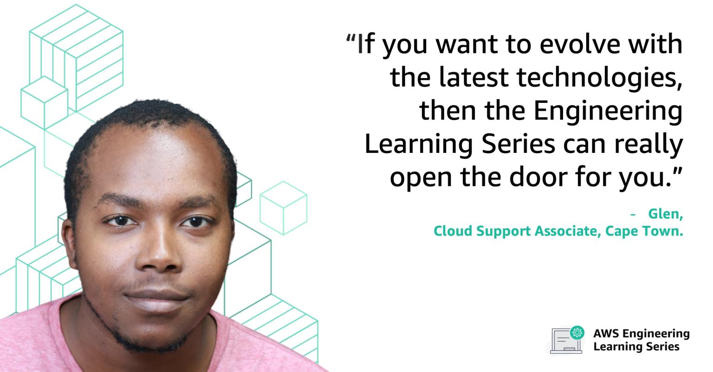

# [Labs - Taming Big Data with Elastic MapReduce (EMR) on AWS](https://www.linkedin.com/posts/nikki-pahliney-4665b818_taming-big-data-with-elastic-mapreduce-emr-activity-6755943060984602624-lEeZ/)

On 18, 19 and 22 August 2021 (6PM to 9PM) AWS Premium Support South Africa is hosting “Taming Big Data with Elastic MapReduce (EMR) on AWS" virtual recruiting event, where you will have the opportunity to attend technical industry workshops with our Cloud Support Engineers in Big Data and better understand what it takes to be successful in the interview process with us!

If you are an aspiring Big Data guru with experience of Distributed Systems, Big Data Technologies, Database Administration and Database Design and/or Coding, join us! Registration is required - hope to see you there!

Register here : https://lnkd.in/dJr-aFD

#### #AWS #cloudcomputing #BigData #Hive #Yarn #ApacheSpark #Hadoop #DistributedSystems #Developer #SoftwareEngineering #HiringEvent #VLS #VirtualLearningSeries

