# Running HDFS commands

## Part 1: In the EC2 Dashboard Select the Master Instance

  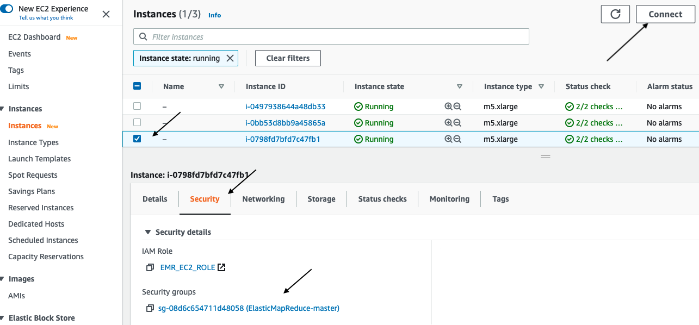

  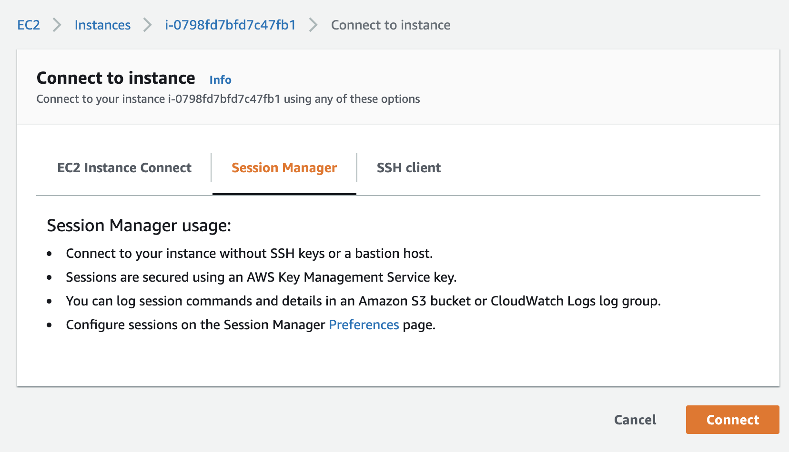


If your login is successful, you will see a welcome screen, which looks like below.

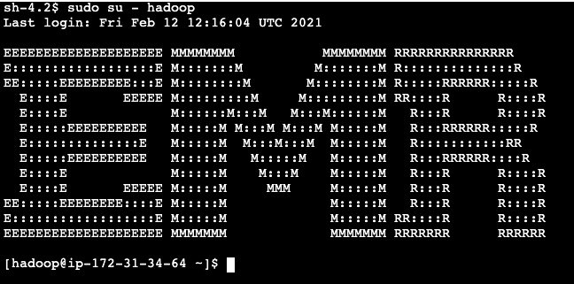


## Part 2: Demonstration of HDFS blocks, replication and sample commands.

1. Run the following command to list the content of the s3 location `s3://amazon-reviews-pds/parquet/product_category=Books/`
  ```
  aws s3 ls s3://amazon-reviews-pds/parquet/product_category=Books/
  ```
  
  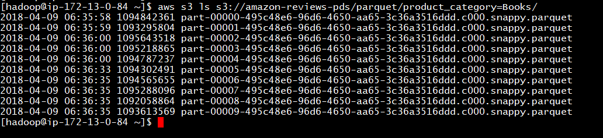

2. Copy the first file in the list to your home using the following command:
  ```
  aws s3 cp s3://amazon-reviews-pds/parquet/product_category=Books/part-00000-495c48e6-96d6-4650-aa65-3c36a3516ddd.c000.snappy.parquet .
  ```
  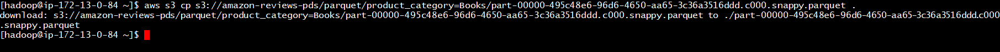

3. Copy the file which you copied in  previous step from your home directory to HDFS using the command below:
  ```
  hdfs dfs -put part-00000-495c48e6-96d6-4650-aa65-3c36a3516ddd.c000.snappy.parquet /user/hadoop
  
  ```
  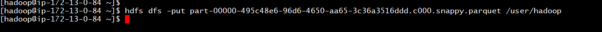

  To verify that the file has been copied to HDFS (`/user/hadoop/part-00000-495c48e6-96d6-4650-aa65-3c36a3516ddd.c000.snappy.parquet`), you can run:
  ```
  hdfs dfs -ls /user/hadoop
  ```

4. Check the file block location for the above file using the command:
  ```
  hdfs fsck filename -files -blocks -locations
  hdfs fsck /user/hadoop/part-00000-495c48e6-96d6-4650-aa65-3c36a3516ddd.c000.snappy.parquet -files  -blocks -locations
  ```
  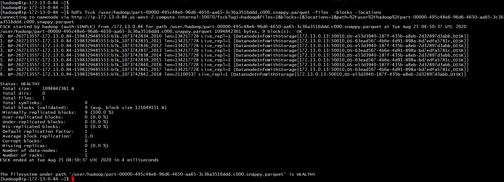

  * What is the current replication factor?      
  * How many HDFS blocks were created from the file?
  * What is the size of a block from the above output?      

5. Set the replication of that file to 3 then check the locations of the blocks again.
  ```
  hdfs dfs -setrep 2 /user/hadoop/part-00000-495c48e6-96d6-4650-aa65-3c36a3516ddd.c000.snappy.parquet
  ```

## Part 3: HDFS administration

1. Check the Namenode logs to understand which data node has the block. To do this, please open the following file with a commandline editor (vi, vim, nano) and check
  ```
  vi /var/log/hadoop-hdfs/hadoop-hdfs-namenode-ip-*.log
  ```
  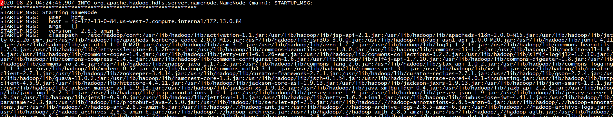

  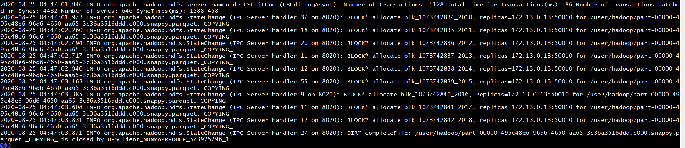    

2. Logon to a core node and check the data node logs as well. To logon to core node, go to the EC2 dashboard and select the data node instances. Then login to the core node and check the data node logs in location `/var/log/hadoop-hdfs/`.

  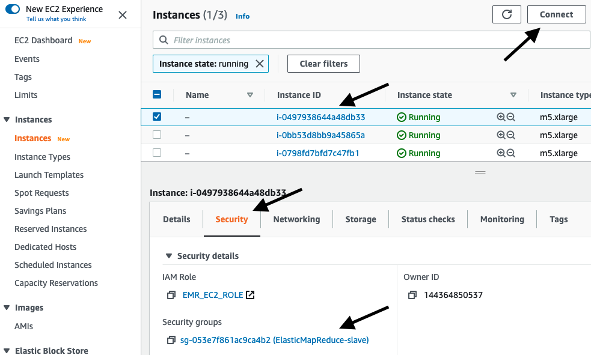

  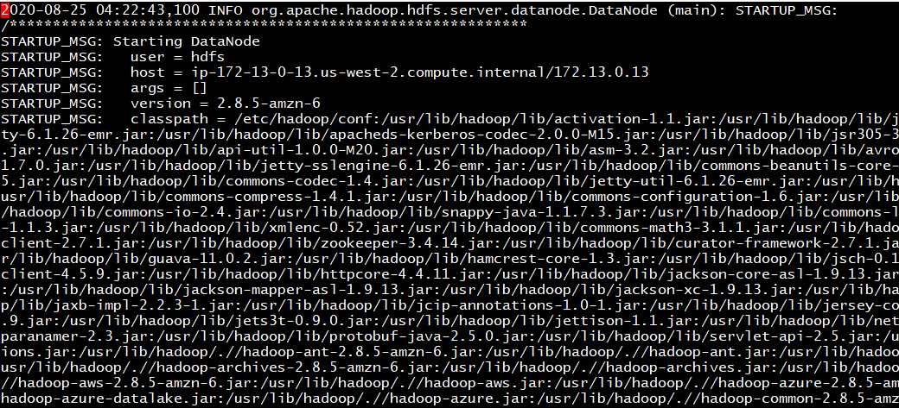

  Search for keywords “src:” and “dest:” to see the source and destination of blocks during replication:

  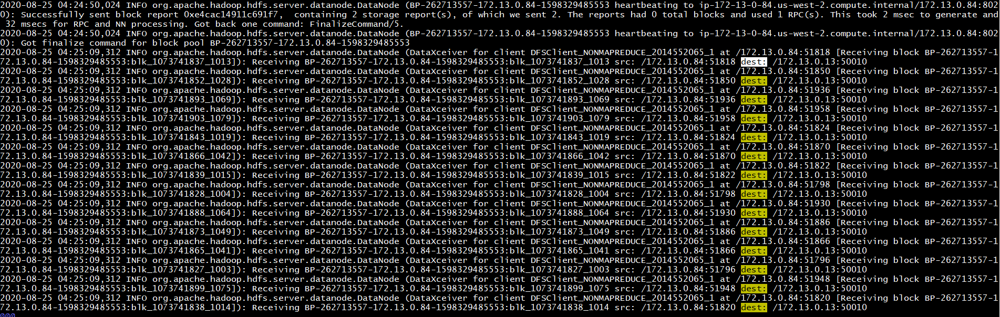

3. Logout of the core node and login to the master node.

4. Copy another parquet file from the s3 location `s3://amazon-reviews-pds/parquet/product_category=Books/` to the master node home directory
  ```
  aws s3 cp s3://amazon-reviews-pds/parquet/product_category=Books/part-00002-495c48e6-96d6-4650-aa65-3c36a3516ddd.c000.snappy.parquet .
  ```

5. Check whether the name node is in safe mode
  ```
  hdfs dfsadmin -safemode get
  ```

6. Set the name node to safemode  using the command below and try to copy the new file to hdfs.
  ```
  hdfs dfsadmin -safemode enter
  ```
  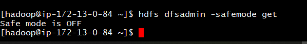

    You can run `hdfs dfsadmin -safemode get` again to confirm that Namenode is in  is safe mode,

7. Now, try to write to hdfs using the following command:
  ```
  hdfs dfs -put part-00002-495c48e6-96d6-4650-aa65-3c36a3516ddd.c000.snappy.parquet /user/hadoop
  ```

  What do you observe?

  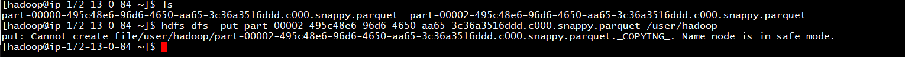

8.  Turn off safe mode by running the following command and repeat step 7 above. What do you observe?
  ```
  hdfs dfsadmin -safemode leave
  ```
  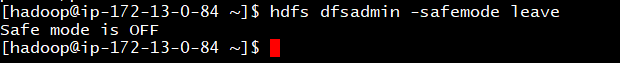

9. Run the following command to see summary information about HDFS.
  ```
  sudo -u hdfs hdfs dfsadmin -report
  ```
  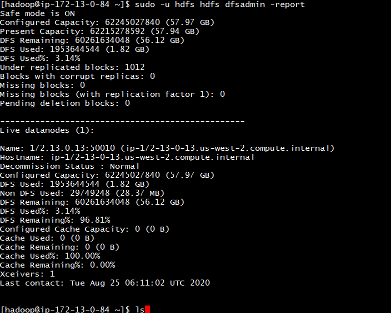

Congratulations, you have completed the HDFS lab.
