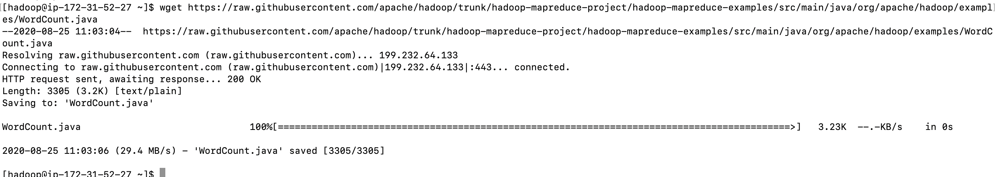
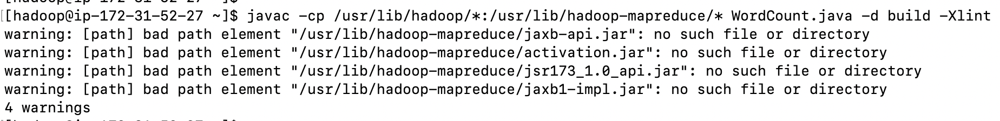
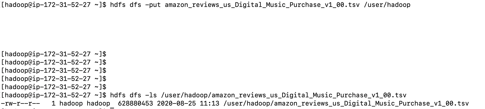

# MapReduce Lab

1. Login to EMR Master Node

2. Download the Word Count.java
  ```
  wget https://raw.githubusercontent.com/apache/hadoop/trunk/hadoop-mapreduce-project/hadoop-mapreduce-examples/src/main/java/org/apache/hadoop/examples/WordCount.java
  ```
  

3. Create a directory

  ```
  mkdir -p build
  ```

4. Compile the wordcount program
  ```
  javac -cp /usr/lib/hadoop/*:/usr/lib/hadoop-mapreduce/* WordCount.java -d build -Xlint
  ```
  

5. Create the wordcount jar file
  ```
  jar -cvf wordcount.jar -C build/ .
  ```

6. Download the input file into local machine
  ```
  aws s3 cp s3://amazon-reviews-pds/tsv/amazon_reviews_us_Digital_Music_Purchase_v1_00.tsv.gz .
  ```

7. Gunzip the file
  ```
  gunzip amazon_reviews_us_Digital_Music_Purchase_v1_00.tsv.gz
  ```

8. Put the file into HDFS
  ```
  hdfs dfs -put amazon_reviews_us_Digital_Music_Purchase_v1_00.tsv /user/hadoop
  
  hdfs dfs -ls /user/hadoop/amazon_reviews_us_Digital_Music_Purchase_v1_00.tsv  
  ```
  
      

9. Run the Hadoop wordcount program
  ```
  hadoop jar wordcount.jar org.apache.hadoop.examples.WordCount /user/hadoop/amazon_reviews_us_Digital_Music_Purchase_v1_00.tsv /user/hadoop/output
  ```
  

10. Checking YARN logs
  * Application logs
  ```
  [hadoop@ip-10-0-3-125 ~]$ yarn application --list -appStates FINISHED 
  20/08/25 18:45:27 INFO client.RMProxy: Connecting to ResourceManager at ip-10-0-3-125.eu-west-1.compute.internal/10.0.3.125:8032
  Total number of applications (application-types: [] and states: [FINISHED]):1
                Application-Id	    Application-Name	    Application-Type	      User	     Queue	             State	       Final-State	       Progress	                       Tracking-URL
  application_1598380160354_0002	          word count	           MAPREDUCE	    hadoop	   default	          FINISHED	         SUCCEEDED	           100%	http://ip-10-0-3-125.eu-west-1.compute.internal:19888/jobhistory/job/job_1598380160354_0002

  ```
  
  ```
  [hadoop@ip-10-0-3-125 ~]$ yarn logs --applicationId application_1598380160354_0002 
    
  ``` 
  > You can view the output of logs in this the [appliactions_logs.txt](resources/logs.txt) file
  
  * Container logs 
    ```
    [hadoop@ip-10-0-3-125 ~]$ yarn applicationattempt -list application_1598380160354_0002
    20/08/25 18:50:28 INFO client.RMProxy: Connecting to ResourceManager at ip-10-0-3-125.eu-west-1.compute.internal/10.0.3.125:8032
    Total number of application attempts :1
             ApplicationAttempt-Id	               State	                    AM-Container-Id	                       Tracking-URL
    appattempt_1598380160354_0002_000001	            FINISHED	container_1598380160354_0002_01_000001	http://ip-10-0-3-125.eu-west-1.compute.internal:20888/proxy/application_1598380160354_0002/
    ```    
    
    ```
    [hadoop@ip-10-0-3-125 ~]$ yarn container -list appattempt_1598380160354_0002_000001
    20/08/25 18:56:12 INFO client.RMProxy: Connecting to ResourceManager at ip-10-0-3-125.eu-west-1.compute.internal/10.0.3.125:8032
    Total number of containers :0
                      Container-Id	          Start Time	         Finish Time	               State	                Host	   Node Http Address	                            LOG-URL

    ```
    
    ```
    [hadoop@ip-10-0-3-125 ~]$ yarn container -status container_1598380160354_0002_01_000001

    ```
