# Hive - S3 vs HDFS

### Pre-requisites
1. Login to emr cluster master node

2. Change the present working directory to `/home/hadoop` using command `cd`, after that check if you are in directory `/home/hadoop` using command `pwd`
    ```
    cd
    pwd
    ```
    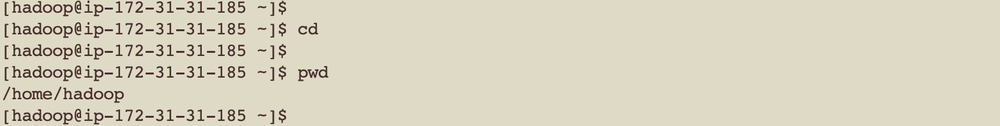

3. Check if you have an access to s3 locations using below commands
    ```
    aws s3 ls s3://eu-central-1.elasticmapreduce.samples/cloudfront/data/
    aws s3 ls s3://eu-central-1.elasticmapreduce.samples/cloudfront/code/Hive_CloudFront.q
    ```

    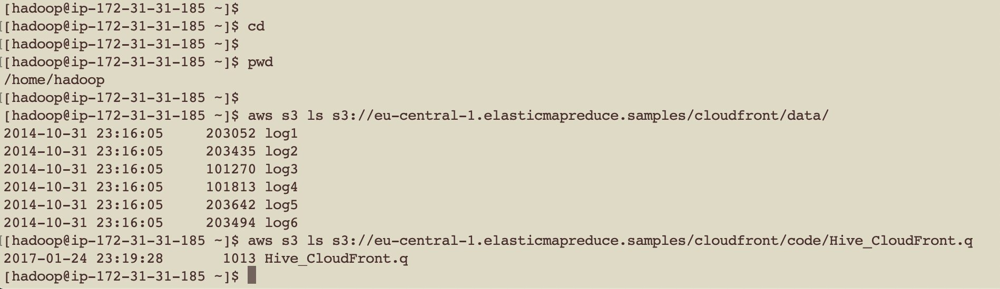

4. Download the `Hive_CloudFront.q` and `log1` files on emr master node and check if they are downloaded using below commands:
    ```
    aws s3 cp s3://eu-central-1.elasticmapreduce.samples/cloudfront/code/Hive_CloudFront.q .
    aws s3 cp s3://eu-central-1.elasticmapreduce.samples/cloudfront/data/log1 .
    ls -l /home/hadoop/
    ```

    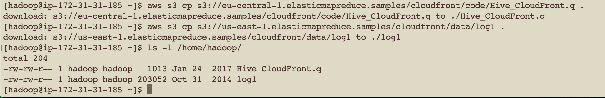

5. Create an hdfs directory `/user/hadoop/test_extrenal_hive_tbl_hdfs` and upload `log1` file inside it, after that check if it has been uploaded using below commands
    ```
    hdfs dfs -mkdir /user/hadoop/test_extrenal_hive_tbl_hdfs
    hdfs dfs -put /home/hadoop/log1 /user/hadoop/test_extrenal_hive_tbl_hdfs
    hdfs dfs -ls /user/hadoop/test_extrenal_hive_tbl_hdfs
    ```

    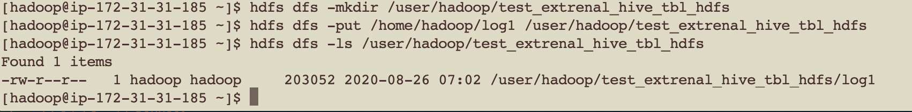

6. Print the content of the file using command `cat` and try to read the content of file, understand the definition of the table
    ```
    cat Hive_CloudFront.q
    ```

    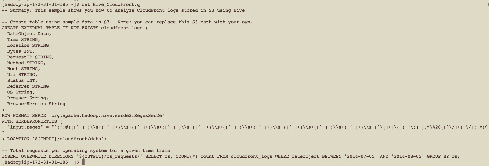

8. Log in to hive-shell by typing command `hive` on the command line of EMR master node
hive

    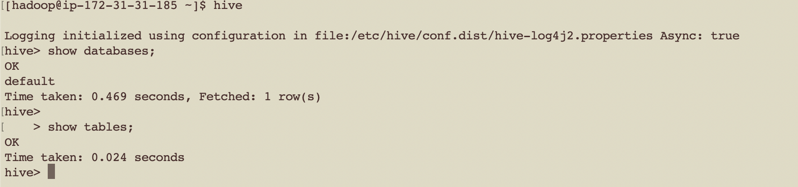

##  Hive external table on hdfs location

1. Create new external table with name `test_extrenal_hive_tbl_hdfs` on hdfs data location using below command
    ```
    CREATE EXTERNAL TABLE IF NOT EXISTS test_extrenal_hive_tbl_hdfs (
      DateObject Date,
      Time STRING,
      Location STRING,
      Bytes INT,
      RequestIP STRING,
      Method STRING,
      Host STRING,
      Uri STRING,
      Status INT,
      Referrer STRING,
      OS String,
      Browser String,
      BrowserVersion String
    )
    ROW FORMAT SERDE 'org.apache.hadoop.hive.serde2.RegexSerDe'
    WITH SERDEPROPERTIES (
      "input.regex" = "^(?!#)([^ ]+)\\s+([^ ]+)\\s+([^ ]+)\\s+([^ ]+)\\s+([^ ]+)\\s+([^ ]+)\\s+([^ ]+)\\s+([^ ]+)\\s+([^ ]+)\\s+([^ ]+)\\s+[^\(]+[\(]([^\;]+).*\%20([^\/]+)[\/](.*)$"
    ) LOCATION 'hdfs:///user/hadoop/test_extrenal_hive_tbl_hdfs';
    ```

    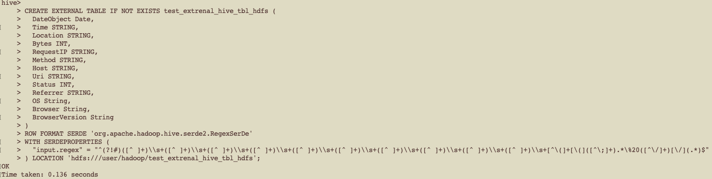

2. Check if table has been created using below commands
    ```
    show tables;
    ```

    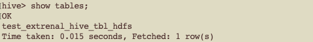

3. Run below SQL to query data stored on hdfs using hive external table pointing to hdfs
    ```
    SELECT os, COUNT(*) count FROM test_extrenal_hive_tbl_hdfs WHERE dateobject BETWEEN '2014-07-05' AND '2014-08-05' GROUP BY os;
    ```

    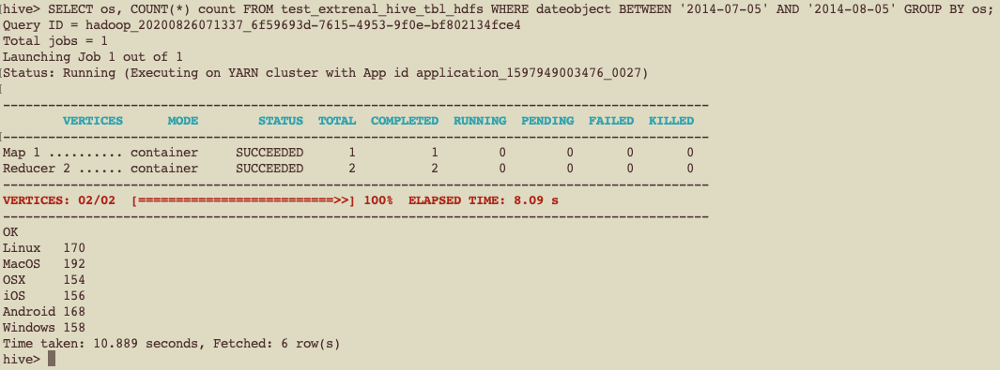

## Hive external table on s3 location
1. Create new external table with name 'test_extrenal_hive_tbl_s3' on s3 data location using below command
    ```
    CREATE EXTERNAL TABLE IF NOT EXISTS test_extrenal_hive_tbl_s3 (
      DateObject Date,
      Time STRING,
      Location STRING,
      Bytes INT,
      RequestIP STRING,
      Method STRING,
      Host STRING,
      Uri STRING,
      Status INT,
      Referrer STRING,
      OS String,
      Browser String,
      BrowserVersion String
    )
    ROW FORMAT SERDE 'org.apache.hadoop.hive.serde2.RegexSerDe'
    WITH SERDEPROPERTIES (
      "input.regex" = "^(?!#)([^ ]+)\\s+([^ ]+)\\s+([^ ]+)\\s+([^ ]+)\\s+([^ ]+)\\s+([^ ]+)\\s+([^ ]+)\\s+([^ ]+)\\s+([^ ]+)\\s+([^ ]+)\\s+[^\(]+[\(]([^\;]+).*\%20([^\/]+)[\/](.*)$"
    ) LOCATION 's3://eu-central-1.elasticmapreduce.samples/cloudfront/data/';
    ```

  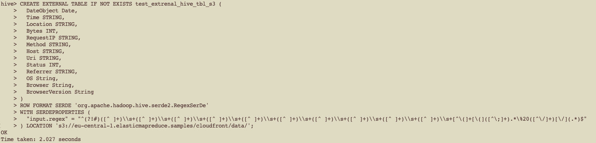

2. Check if table has been created using below commands
    ```
    show tables;
    ```

    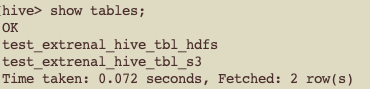

3. Run below SQL to query data stored on hdfs using hive external table pointing to s3
    ```
    SELECT os, COUNT(*) count FROM test_extrenal_hive_tbl_s3 WHERE dateobject BETWEEN '2014-07-05' AND '2014-08-05' GROUP BY os;
    ```

## Hive managed table
1. Create the hive managed table using below command, notice we are not providing a location in the table definition
    ```
    CREATE TABLE IF NOT EXISTS test_managed_hive_tbl (
      DateObject Date,
      Time STRING,
      Location STRING,
      Bytes INT,
      RequestIP STRING,
      Method STRING,
      Host STRING,
      Uri STRING,
      Status INT,
      Referrer STRING,
      OS String,
      Browser String,
      BrowserVersion String
    )
    ROW FORMAT SERDE 'org.apache.hadoop.hive.serde2.RegexSerDe'
    WITH SERDEPROPERTIES (
      "input.regex" = "^(?!#)([^ ]+)\\s+([^ ]+)\\s+([^ ]+)\\s+([^ ]+)\\s+([^ ]+)\\s+([^ ]+)\\s+([^ ]+)\\s+([^ ]+)\\s+([^ ]+)\\s+([^ ]+)\\s+[^\(]+[\(]([^\;]+).*\%20([^\/]+)[\/](.*)$"
    );
    ```

    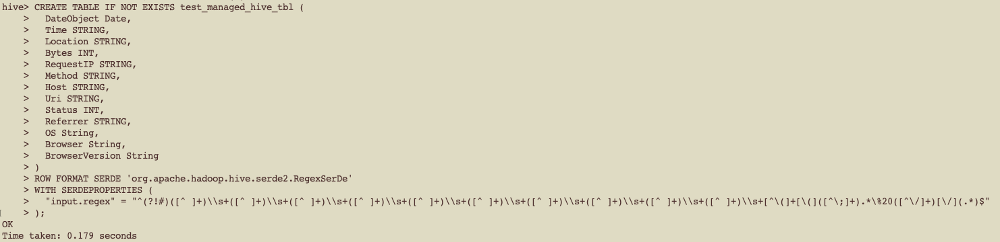

2. Check if table is created and its definition using below commands
    ```
    show tables;
    ```

    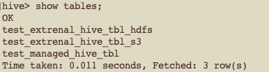

3. Check the location of table from `hive-shell`, notice a folder `test_managed_hive_tbl` is created under `/user/hive/warehouse/`
    ```
    show create table test_managed_hive_tbl;
    ```

    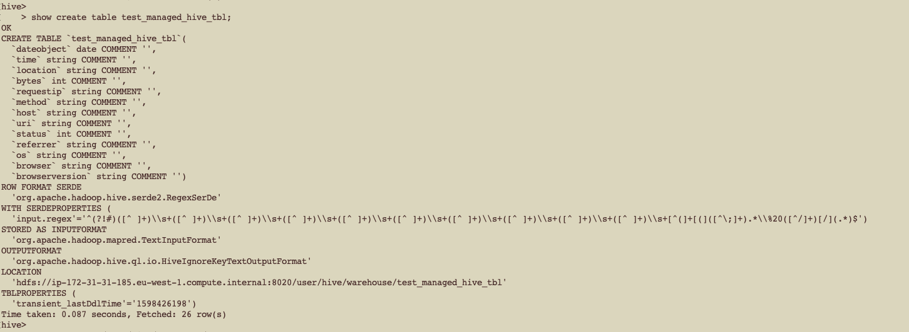

4. Check the contents of the folder `test_managed_hive_tbl` created under `/user/hive/warehouse/`
    ```
    !hdfs dfs -ls /user/hive/warehouse/;
    ```

    

5. Check if data is present in table location from `hive-shell` using below command
    ```
    !hdfs dfs -ls /user/hive/warehouse/test_managed_hive_tbl;
    ```

    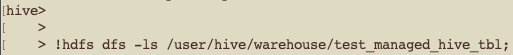

6. Load the data into the table using below command, notice we are copying data from external hdfs location to managed hdfs location
    ```
    load data local inpath '/home/hadoop/log1' into table test_managed_hive_tbl;
    ```

    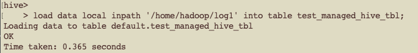

7. Check if data is loaded in the table location from `hive-shell` using below command, notice file `log1` is added now
    ```
    !hdfs dfs -ls /user/hive/warehouse/test_managed_hive_tbl;
    ```

    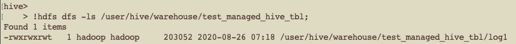

8. Run below SQL to query data stored on hdfs using hive managed table
    ```
    SELECT os, COUNT(*) count FROM test_managed_hive_tbl WHERE dateobject BETWEEN '2014-07-05' AND '2014-08-05' GROUP BY os;
    ```

    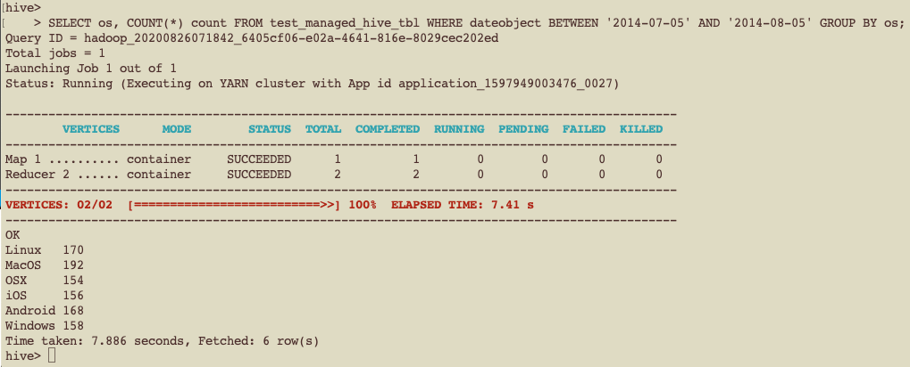

### Delete behavior for hive managed table
1. Drop managed table and check if table is dropped using below commands,
    ```
    show tables;
    drop table test_managed_hive_tbl;
    show tables;
    ```

2. Check if the data is removed from table location from `hive-shell` using below command, notice a folder `test_managed_hive_tbl` is deleted from `/user/hive/warehouse/`
    ```
    !hdfs dfs -ls /user/hive/warehouse/;
    ```

    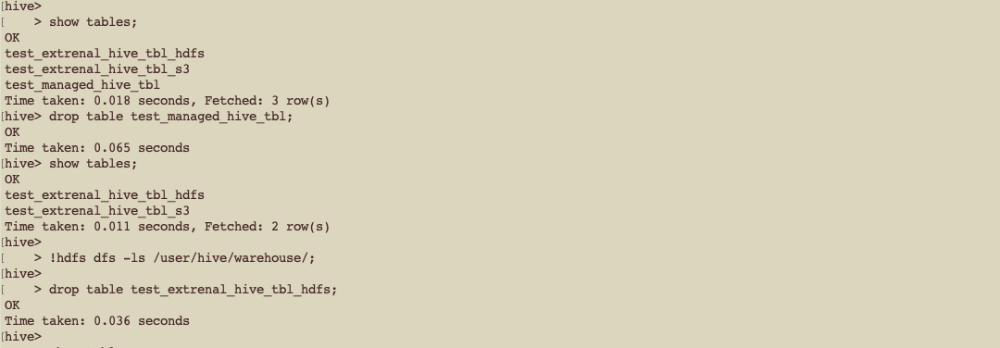

### Delete behavior for hive external table
1. Drop external table which is pointing to hdfs using below command,
    ```
    drop table test_extrenal_hive_tbl_hdfs;
    show tables;
    ```

2. Check if data is removed from table location from hive-shell using below command, notice a folder `test_extrenal_hive_tbl_hdfs` is NOT deleted from `/user/hadoop/`
    ```
    !hdfs dfs -ls /user/hadoop/test_extrenal_hive_tbl_hdfs;
    ```

3. Exit hive cli
> press `ctrl+c` to exit the hive-shell
