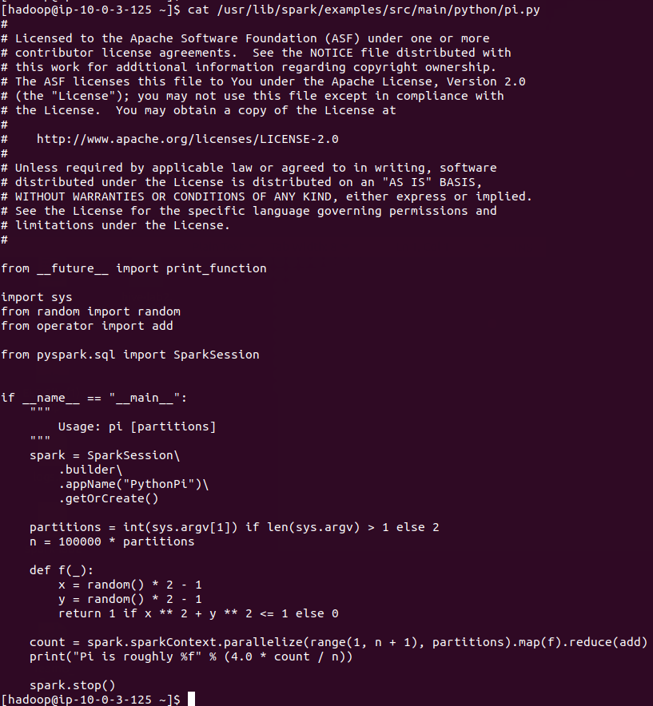

# Spark Lab 1 - YARN cluster/YARN client/local mode

1. sparkpi display the content of sparkpi
    ```
    cat /usr/lib/spark/examples/src/main/python/pi.py
    ```

    

2. Run on YARN cluster in client mode
    ```
    /usr/bin/spark-submit \
    --class org.apache.spark.examples.SparkPi \
    --master yarn \
    --deploy-mode client \
    /usr/lib/spark/examples/jars/spark-examples.jar \
    10

    ```

    > You can view output of how the command should like here: [output.txt](resources/2_client_mode.txt)

3. Run on YARN cluster in cluster mode
    ```
    /usr/bin/spark-submit \
    --class org.apache.spark.examples.SparkPi \
    --master yarn \
    --deploy-mode cluster \
    /usr/lib/spark/examples/jars/spark-examples.jar \
    10

    ```

    > You can view output of how the command should like here: [output.txt](resources/3_cluster_mode.txt)

4. Python word count running locally on 4 cores
    ```
    cd /usr/lib/spark/
    /usr/bin/spark-submit --master local[4] /usr/lib/spark/examples/src/main/python/wordcount.py 'file:///usr/lib/spark/examples/src/main/resources/people.txt'
    ```

    > You can view output of how the command should like here: [output.txt](resources/4_wordCount.txt)

5. Python word count hdfs
    ```
    hdfs dfs -put /usr/lib/spark/examples/src/main/resources/people.txt /user/hadoop
    hdfs dfs -ls /user/hadoop

    ```
    > You can view output of how the command should like here: [output.txt](resources/5_hdfs.txt)

    ```    
    /usr/bin/spark-submit /usr/lib/spark/examples/src/main/python/wordcount.py /user/hadoop/people.txt
    ```    
    > You can view output of how the command should like here: [output.txt](resources/6_spark_hdfs.txt)

6. A simple example demonstrating Spark SQL Hive integration. Run with:
    ```
    cd /usr/lib/spark/
    ./bin/spark-submit examples/src/main/python/sql/hive.py
    ```
    > You can view output of how the command should like here: [output.txt](resources/7_sql.txt)
