# Spark Lab 2 - Partitions 

1. Launch an EMR cluster with hive and spark applications ( skip this step if emr is already running )

2. Connect to master node of EMR cluster using ssh ( skip this step if already logged in)

3. Check if you have an access to below s3 location
    ```
    aws s3 ls s3://amazon-reviews-pds/parquet/
    ```
    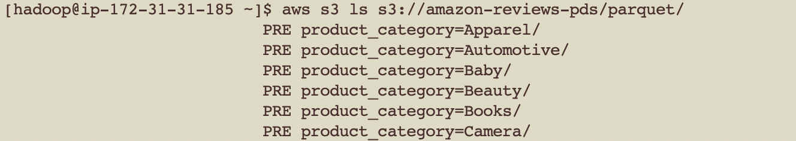

4. Launch pyspark shell - by typing command pyspark on master node command line
    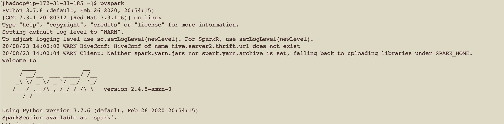

5. Create dataframes using spark structured API
    ```
    camera_df=spark.read.parquet("s3://amazon-reviews-pds/parquet/product_category=Camera")
    apparel_df=spark.read.parquet("s3://amazon-reviews-pds/parquet/product_category=Apparel")
    ```
    

6. Check the number of partition
    ```
    apparel_df.rdd.getNumPartitions()
    apparel_df=camera_df.coalesce(1)
    apparel_df.rdd.getNumPartitions()
    ```
    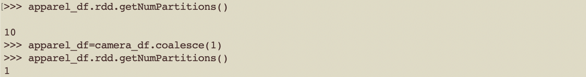

    ```
    camera_df.rdd.getNumPartitions()
    camera_df=camera_df.coalesce(1)
    camera_df.rdd.getNumPartitions()
    ```

7. Join
    ```
    joinedDF = camera_df.join(apparel_df, 'customer_id', 'fullouter')
    ```

8. Check the query plan, try to read it from bottom up
    ```
    joinedDF.explain()
    ```
    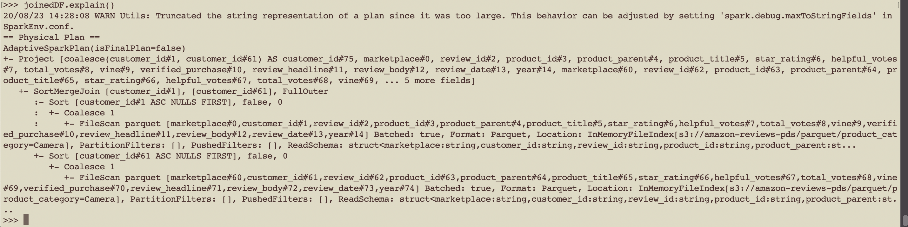

9. Check the extended query plan, try to read different steps
    ```
    joinedDF.explain(extended='true')
    ```
    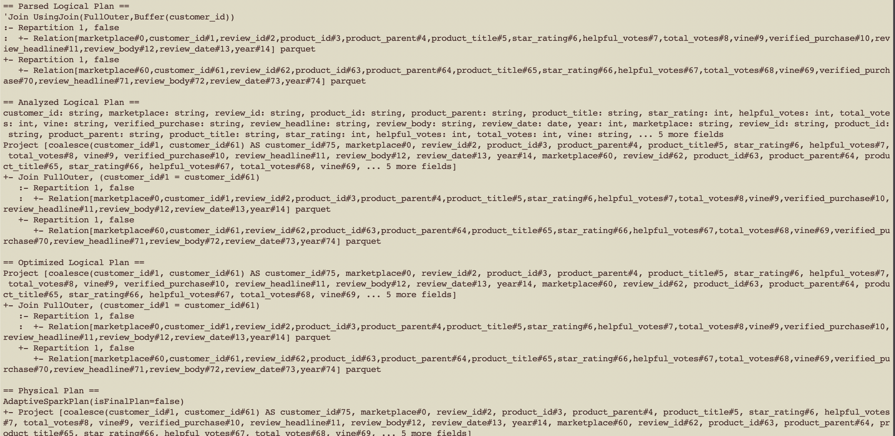

10. Trigger the DAG
      ```
      joinedDF.count()
      ```

11. Executor OOM
      ```
      cross_joinedDF = camera_df.crossJoin(camera_df)
      cross_joinedDF.explain()
      cross_joinedDF.count()
      ```

12. Driver OOM error
      ```
      camera_df.collect()
      ```

13. Spark UI

  * View all applications
    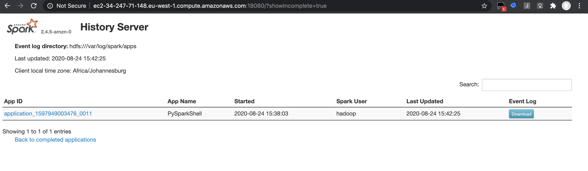

  * View jobs
    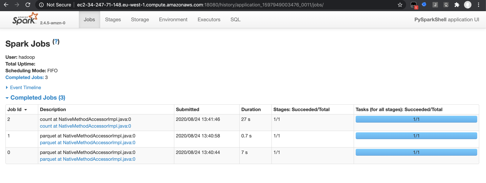

  * View stages
    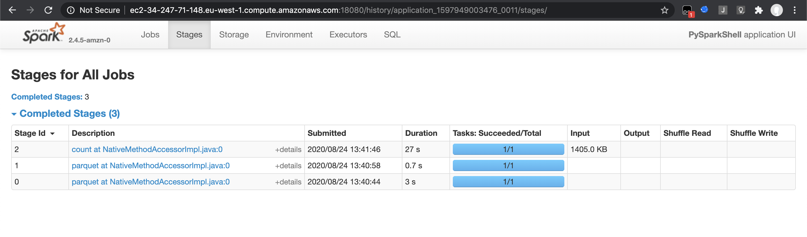

  * View tasks
    

  * View executors
    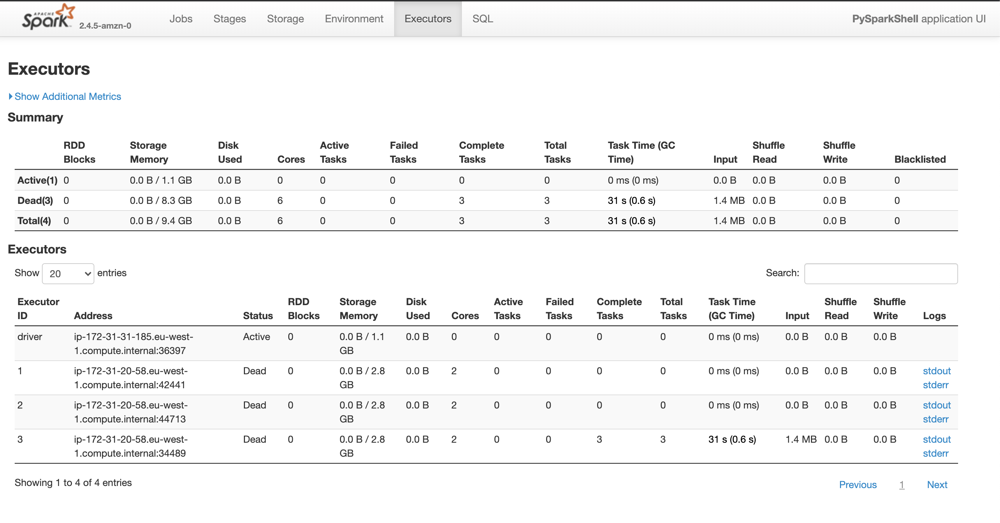

  * View SQL queries on SQL interface
    > 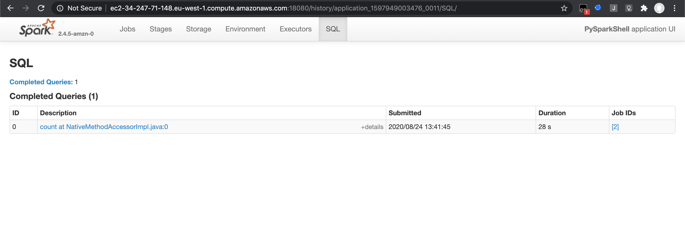
    > 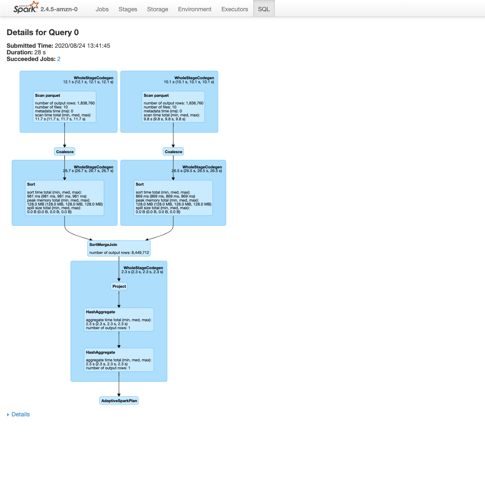

  * View DAG
    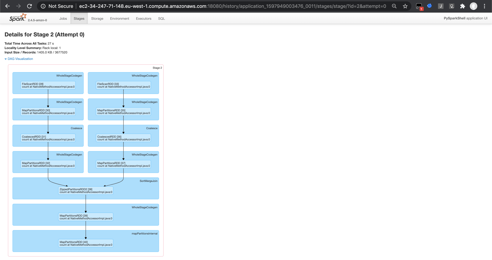

  * View query plan
    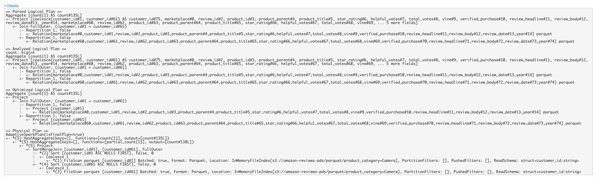
